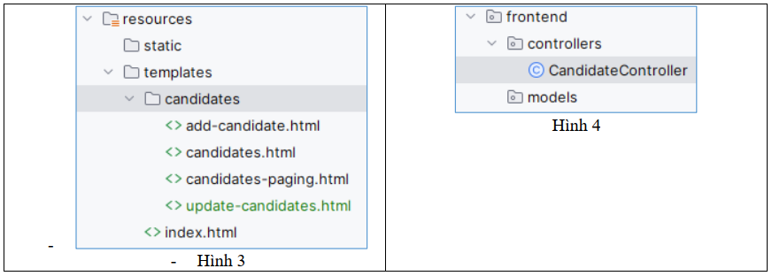
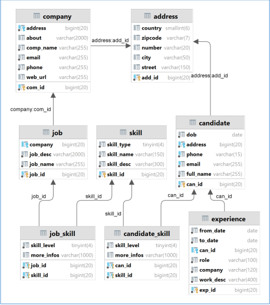
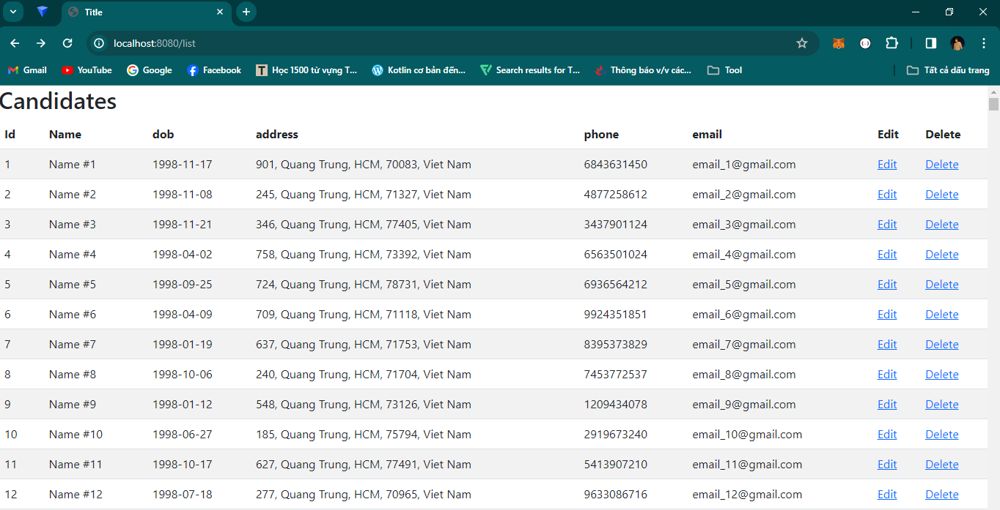
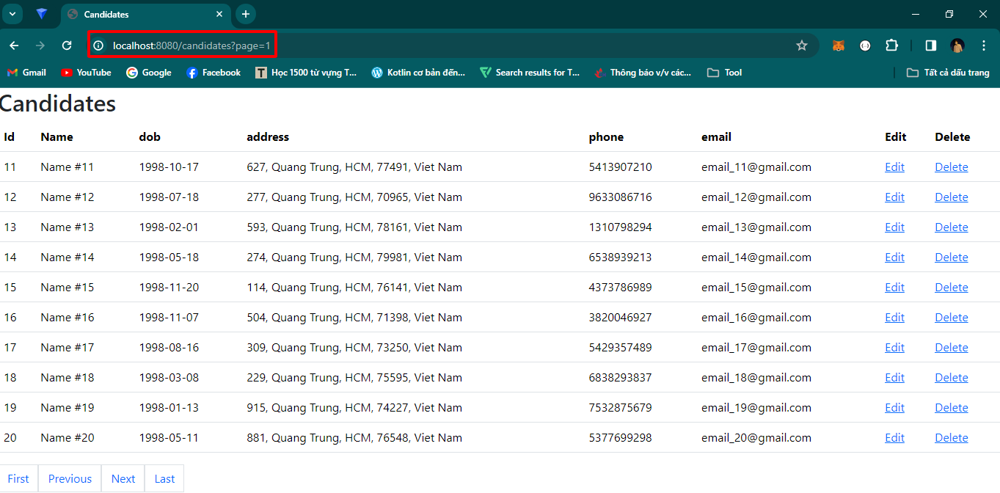
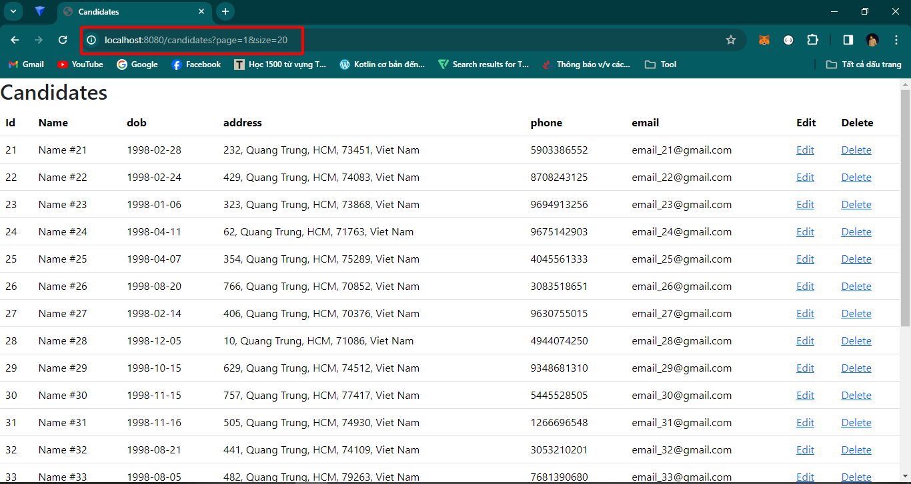

# spring-boot-recruitment

### Information:

Name: Võ Tấn Đạt
ID: 20116031
Subject: Lập trình WWW với công nghệ JAVA

### Description:

Bài tập lab01 week2

Yêu cầu: Thực hiện chức năng phân trang

## 1. Kiến trúc dự án

- Mô hình MVC
- Có backend và frontend

## 2. Cơ sở dữ liệu

## 3. Chức năng

- Hiển thị candidate có phân trang và hiển thị candidate không phân trang
### 3.1 Chức năng hiển thị candidate không phân trang

Link: http://localhost:8080/list

### 3.2 Chức năng hiển thị candidate có phân trang

Link: http://localhost:8080/candidates

- Sử dụng biến page sử dụng để di chuyển đến trang muốn đến

Link: http://localhost:8080/candidates?page=1

- Sử dụng biến page, size 

Link: http://localhost:8080/candidates?page=1&size=20
## 4. Cách chạy dự án

- Clone dự án tại link này
- Mở dự án bằng IntelliJ
- Chọn services là Tomcat
- Bấm build để chạy dự án
- Mở trình duyện và xem dự án tại http://localhost:8080

## 5. Các công cụ đã sử dụng

- IDE : IntelliJ
- Web server : Tomcat
- Database server : MySQL
- Container : Docker (sử dụng docker để chạy MySQL)
- Storage code: GitHub

## 6. Lời cảm ơn

Cảm ơn bạn đã ghé thăm dự án của tôi <3

